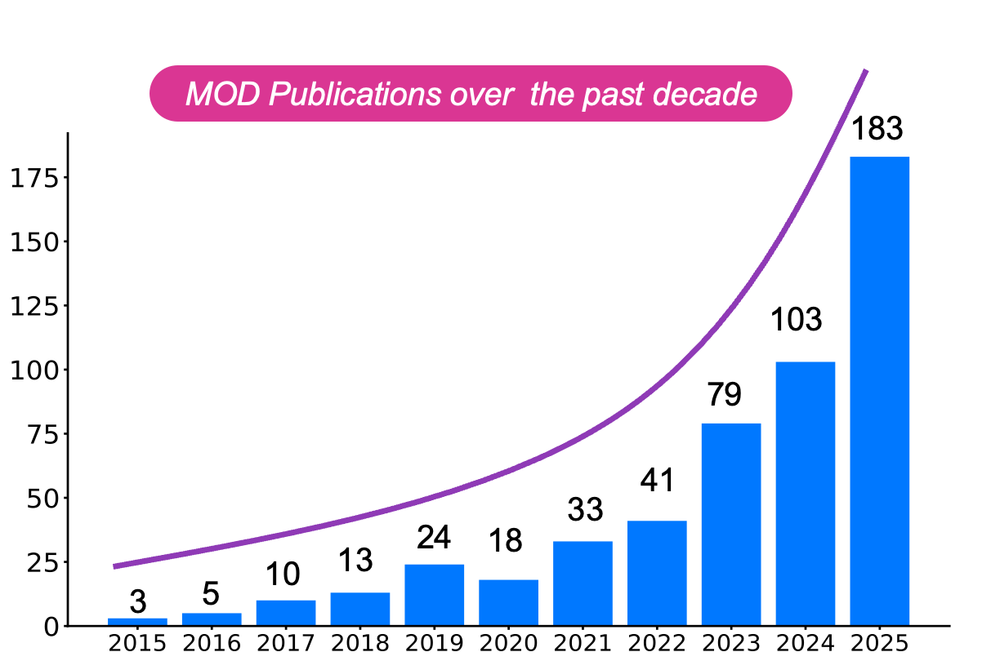
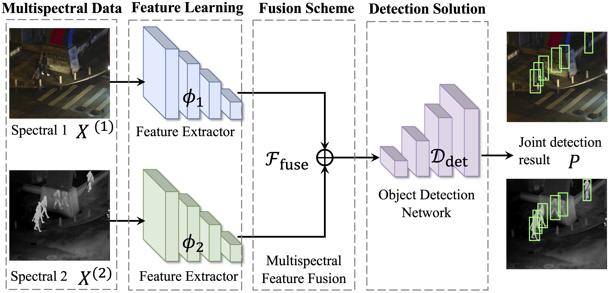
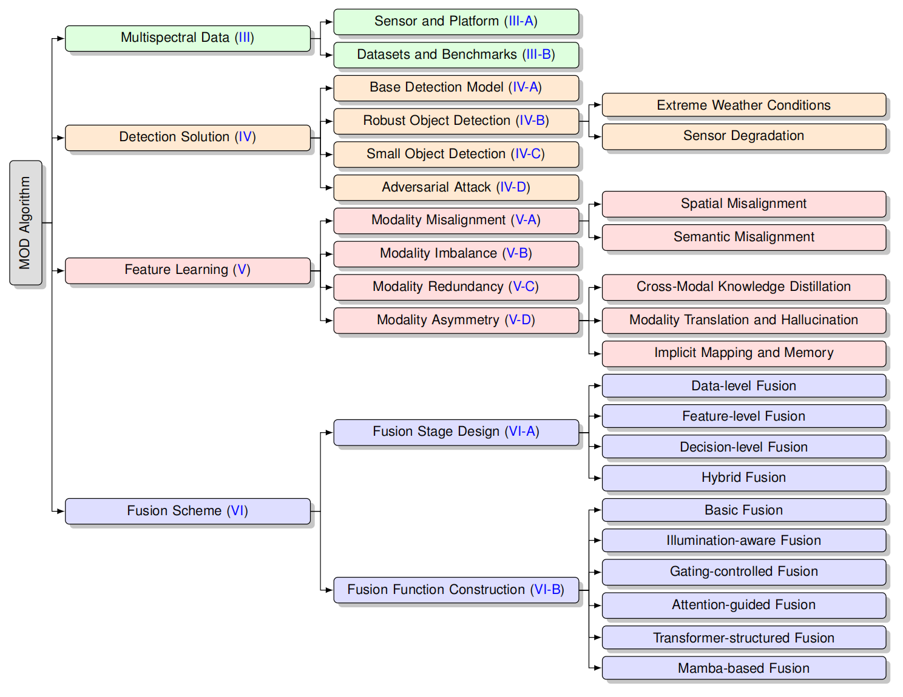
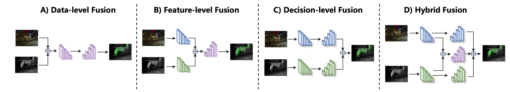
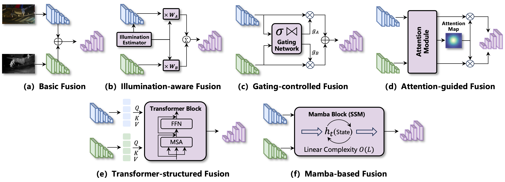

# MOD-ZOO: Multispectral Object Detection - A Unified Framework and Systematic Survey

<div align="center">

[](https://arxiv.org/)
[](https://github.com/DocF/MOD-ZOO)
[](https://awesome.re)
[](https://opensource.org/licenses/MIT)

</div>

This is the official repository for the preprint paper **"Multispectral Object Detection: A Unified Framework and Systematic Survey"**. 

This repository (**MOD-ZOO**) provides a comprehensive, continuously updated collection of resources (papers, codes, datasets) for Multispectral Object Detection (MOD) across Ground-based and Remote Sensing scenarios.

---

## 📑 Table of Contents


- [📢 News](#-news)
- [📖 Abstract](#-abstract)
- [🖼️ Unified Framework & Taxonomy](#️-unified-framework--taxonomy)
- [🗂️ Datasets & Benchmarks](#️-datasets--benchmarks)
  - [Ground-based Datasets](#ground-based-datasets)
  - [Remote Sensing Datasets](#remote-sensing-datasets)
- [📚 Paper List (The MOD Zoo)](#-paper-list-the-mod-zoo)
  - [1. Feature Learning](#1-feature-learning-mitigating-representation-challenges)
  - [2. Fusion Scheme](#2-fusion-scheme)
  - [3. Detection Solutions](#3-detection-solutions-task-specific)

---

## 📢 News
* **[2026/04]** 🔥🔥The preprint will be available on arXiv soon!
* **[2026/04]** 🔥🔥Initial release of the **MOD-ZOO** repository, including taxonomy, datasets, and paper lists.

---

## 📖 Abstract

Multispectral Object Detection (MOD) has emerged as a critical methodology to overcome the limitations of visible-light imaging, particularly under adverse conditions such as low illumination and inclement weather. By integrating complementary information across diverse spectral bands, MOD ensures robust all-day and all-weather perception. 

To provide a systematic survey, a unified four-stage mathematical framework is established, which deconstructs MOD into **multispectral data input**, **feature learning**, **fusion schemes**, and **detection solutions**.

---

## 🖼️ Unified Framework & Taxonomy

Building upon the concepts introduced above, the following figures visualize the structural breakdown of our survey.

* **Figure 1** illustrates the detailed data flow of the unified mathematical framework, mapping the progression from raw multispectral inputs to final detection outputs.
* **Figure 2** expands this framework into a fine-grained hierarchical taxonomy. It categorizes recent state-of-the-art literature based on their specific strategies to overcome core cross-modal challenges.

*This taxonomy directly dictates the organization of the paper list in the following sections.*

<br>

<div align="center">
  
  <p><em>Figure 1. A unified four-stage framework and systematic taxonomy of MOD.</em></p>
</div>

<div align="center">
  
  <p><em>Figure 2. Hierarchical structural decomposition and taxonomy of the MOD landscape.</em></p>
</div>


## 🗂️ Datasets & Benchmarks

An overview of representative MOD datasets spanning ground-based and remote sensing scenarios.
<div align="center">
  
  <p><em>Figure 3. Electromagnetic spectrum mapping and visual comparisons.</em></p>
</div>

### Ground-based Datasets

*(Legend: **Pairs** = Img Pairs, **Res.** = Resolution, **Plat.** = Platform(Surv. = Surveillance, Multi. = Multiple), **Cls** = Class, **A/O** = Alignment / Occlusion)*
<div align="center">
  
| Dataset | Venue | Modality | Pairs | Res. | Plat. | Cls | Den. | A/O | Link |
| :--- | :---: | :---: | :---: | :---: | :--- | :---: | :---: | :---: | :---: |
| KAIST | CVPR'15 | <nobr>RGB-TIR</nobr> | 95.3K | 640x480 | Driving | 1 | 0.62 | ✅/✅ | [Link](https://soonminhwang.github.io/rgbt-ped-detection/) |
| CVC-14 | Sensors'16 | <nobr>RGB-TIR</nobr> | 8.5K | 640x512 | Driving | 1 | 0.80 | ❌/❌ | [Link](http://adas.cvc.uab.es/elektra/enigma-portfolio/cvc-14-visible-fir-day-night-pedestrian-sequence-dataset/) |
| FLIR-aligned | ICIP'20 | <nobr>RGB-TIR</nobr> | 5.1K | 640x512 | Driving | 3 | 7.92 | ✅/✅ | [Link](https://github.com/CalayZhou/Multispectral-Pedestrian-Detection-Resource) |
| LLVIP | ICCV'21 | <nobr>RGB-TIR</nobr> | 16.8K | 1080x720 | Surv. | 1 | 2.51 | ✅/❌ | [Link](https://bupt-ai-cz.github.io/LLVIP/) |
| M³FD | CVPR'22 | <nobr>RGB-TIR</nobr> | 4.2K | 1024x768 | Multi. | 6 | 8.19 | ✅/❌ | [Link](https://github.com/JinyuanLiu-CV/TarDAL) |
| SMOD | TMM'25 | <nobr>RGB-TIR</nobr> | 8.6K | 640x512 | Driving | 4 | 3.62 | ✅/✅ | [Link](https://arxiv.org/abs/2405.12944) |
| MFAD | TCSVT'25 | <nobr>RGB-TIR</nobr> | 12.1K | 1280x960 | Driving | 6 | 7.13 | ✅/❌ | [Link](https://github.com/yikangshao/RSC-MD) |

</div>


### Remote Sensing Datasets


*(Legend: **Pairs** = Img Pairs, **Res.** = Resolution, **Plat.** = Platform, **Cls** = Class, **A/O** = Alignment / Occlusion)*
<div align="center">
  
| Dataset | Venue | Modality | Pairs | Res. | Plat. | Cls | Den. | A/O | Link |
| :--- | :---: | :---: | :---: | :---: | :--- | :---: | :---: | :---: | :---: |
| VEDAI | JVCI'16 | <nobr>R-NIR</nobr> | 1.2K | 1024x1024 | UAV | 9 | 2.93 | ✅/❌ | [Link](https://sebastien.razakarivony.free.fr/vedai/) |
| DroneVehicle | TCSVT'21 | <nobr>R-TIR</nobr> | 28.4K | 840x712 | UAV | 1 | 16.7 | ❌/❌ | [Link](https://github.com/VisDrone/DroneVehicle) |
| DronePerson | ISPRS'23 | <nobr>R-TIR</nobr> | 6.1K | 640x512 | UAV | 1 | 11.6 | ✅/❌ | [Link](https://doi.org/10.1016/j.isprsjprs.2023.01.011) |
| DVTOD | TIV'24 | <nobr>R-TIR</nobr> | 2.1K | 1920x1080 | UAV | 3 | 2.82 | ❌/❌ | [Link](https://github.com/VDT-2048/DVTOD) |
| OdinMJ | GRSM'24 | <nobr>R-TIR</nobr> | 23K | 640x512 | UAV | 1 | 1.98 | ✅/✅ | [Link](https://github.com/KustTeamWQW/ODinMJ-RGB-T-Dataset) |
| RGBT-Tiny | TPAMI'25 | <nobr>R-TIR</nobr> | ~47.5K| 640x512 | UAV | 7 | 12.9 | ✅/❌ | [Link](https://github.com/XinyiYing/RGBT-Tiny) |
| SpaceNet6-OTD| TGRS'22 | <nobr>R-SAR</nobr> | 820 | 900x900 | Sat. | 1 | 22.0 | ✅/❌ | [Link](https://eis-vipg.github.io/SpaceNet6-OTD/) |
| OGSOD-1.0 | TGRS'23 | <nobr>R-SAR</nobr> | 14.6K | 256x256 | Sat. | 3 | 2.62 | ✅/❌ | [Link](https://ieeexplore.ieee.org/document/10183827) |
| OGSOD-2.0 | ICGIP'25 | <nobr>R-SAR</nobr> | 23.4K | 256x256 | Sat. | 4 | 3.24 | ✅/❌ | [Link](https://doi.org/10.1117/12.3057720) |

</div>
```


## 📚 Paper List (The MOD Zoo)

We categorize representative methods according to our proposed taxonomy.

### 1. Feature Learning (Mitigating Representation Challenges)
This section addresses fundamental representation challenges: **Modality Misalignment**, **Modality Imbalance**, **Modality Redundancy**, and **Modality Asymmetry**.

#### Modality Misalignment

| Venue | Methods | Title | Modality | Source |
| :---: | :--- | :--- | :---: | :---: |
| AAAI'26 | <nobr>IGIANet</nobr> | Igianet: Illumination guided implicit alignment network for infrared-visible uav detection | <nobr>RGB-TIR</nobr> | [Paper](https://ojs.aaai.org/index.php/AAAI/article/view/37298) |
| TMM'25 | <nobr>DeformCAT</nobr> | Deformable cross-attention transformer for weakly aligned rgb-t pedestrian detection | <nobr>RGB-TIR</nobr> | [Paper](https://ieeexplore.ieee.org/document/10891492/)/[Code](#) |
| TCSVT'25 | <nobr>SeaDATE</nobr> | Seadate: Remedy dual-attention transformer with semantic alignment via contrast learning for multimodal object detection | <nobr>RGB-TIR</nobr> | [Paper](https://ieeexplore.ieee.org/document/10807244/)/[Code](#) |
| CVPR'24 | <nobr>OAFA</nobr> | Weakly misalignment-free adaptive feature alignment for uavs-based multimodal object detection | <nobr>RGB-TIR</nobr> | [Paper](https://openaccess.thecvf.com/content/CVPR2024/papers/Chen_Weakly_Misalignment-free_Adaptive_Feature_Alignment_for_UAVs-based_Multimodal_Object_Detection_CVPR_2024_paper.pdf)/[Code](#) |
| ECCV'24 | <nobr>DAMSDet</nobr> | Damsdet: Dynamic adaptive multispectral detection transformer with competitive query selection and adaptive feature fusion | <nobr>RGB-TIR</nobr> | [Paper](https://www.ecva.net/papers/eccv_2024/papers_ECCV/papers/03984.pdf)/[Code](#) |
| ICIP'24 | <nobr>L-CMAF</nobr> | Revisiting misalignment in multispectral pedestrian detection | <nobr>RGB-TIR</nobr> | [Paper](https://ieeexplore.ieee.org/document/10769164)/[Code](#) |
| TIV'24 | <nobr>YOLO-Adaptor</nobr> | Yolo-adaptor: A fast adaptive one-stage detector for non-aligned visible-infrared object detection | <nobr>RGB-TIR</nobr> | [Paper](https://ieeexplore.ieee.org/document/10510444)/[Code](#) |
| MM'23 | <nobr>AANet</nobr> | Attentive alignment network for multispectral pedestrian detection | <nobr>RGB-TIR</nobr> | [Paper](https://dl.acm.org/doi/10.1145/3581783.3611804)/[Code](#) |
| MM'23 | <nobr>CALNet</nobr> | Multispectral object detection via cross-modal conflict-aware learning | <nobr>RGB-TIR</nobr> | [Paper](https://dl.acm.org/doi/10.1145/3581783.3612030)/[Code](#) |
| TITS'23 | <nobr>MFPT</nobr> | Multi-modal feature pyramid transformer for rgb-infrared object detection | <nobr>RGB-TIR</nobr> | [Paper](https://ieeexplore.ieee.org/document/10007886)/[Code](#) |
| ECCV'22 | <nobr>TSFADet</nobr> | Translation, scale and rotation: cross-modal alignment meets rgb-infrared vehicle detection | <nobr>RGB-TIR</nobr> | [Paper](https://link.springer.com/chapter/10.1007/978-3-031-19815-1_31)/[Code](#) |
| ICCV'19 | <nobr>AR-CNN</nobr> | Weakly aligned cross-modal learning for multispectral pedestrian detection | <nobr>RGB-TIR</nobr> | [Paper](https://openaccess.thecvf.com/content_ICCV_2019/papers/Zhang_Weakly_Aligned_Cross-Modal_Learning_for_Multispectral_Pedestrian_Detection_ICCV_2019_paper.pdf)/[Code](#) |

#### Modality Imbalance

| Venue | Methods | Title | Modality | Source |
| :---: | :--- | :--- | :---: | :---: |
| TCSVT'25 | <nobr>MSCoTDet</nobr> | Mscotdet: Language-driven multi-modal fusion for improved multi-spectral pedestrian detection | <nobr>RGB-TIR</nobr> | [Paper](https://ieeexplore.ieee.org/document/10819422/)/[Code](#) |
| TGRS'25 | <nobr>DKDNet</nobr> | Diffusion mechanism and knowledge distillation object detection in multimodal remote sensing imagery | <nobr>RGB-SAR</nobr> | [Paper](https://ieeexplore.ieee.org/document/10965806/)/[Code](#) |
| InfFus'25 | <nobr>EMOD</nobr> | Efficient multispectral object detection with attentive feature aggregation leveraging zero-shot implicit illumination guidance | <nobr>RGB-TIR</nobr> | [Paper](https://doi.org/10.1016/j.inffus.2024.102830)/[Code](#) |
| ICCV'25 | <nobr>M²D-LIF</nobr> | Rethinking multi-modal object detection from the perspective of mono-modality feature learning | <nobr>RGB-TIR</nobr> | [Paper](https://openaccess.thecvf.com/content/ICCV2025/papers/Zhao_Rethinking_Multi-modal_Object_Detection_from_the_Perspective_of_Mono-Modality_Feature_ICCV_2025_paper.pdf)/[Code](#) |
| TITS'24 | <nobr>MS-DETR</nobr> | MS-DETR: multispectral pedestrian detection transformer with loosely coupled fusion and modality-balanced optimization | <nobr>RGB-TIR</nobr> | [Paper](http://ieeexplore.ieee.org/document/10669167/)/[Code](#) |
| IROS'24 | <nobr>DCSANet</nobr> | Desanet: Dual cross-channel and spatial attention make RGB-T object detection better | <nobr>RGB-TIR</nobr> | [Paper](https://ieeexplore.ieee.org/document/10802081)/[Code](#) |
| CVPR'24 | <nobr>CMM</nobr> | Causal mode multiplexer: A novel framework for unbiased multispectral pedestrian detection | <nobr>RGB-TIR</nobr> | [Paper](https://openaccess.thecvf.com/content/CVPR2024/papers/Kim_Causal_Mode_Multiplexer_A_Novel_Framework_for_Unbiased_Multispectral_Pedestrian_CVPR_2024_paper.pdf)/[Code](#) |
| ECCV'22 | <nobr>MBNet</nobr> | Improving multispectral pedestrian detection by addressing modality imbalance problems | <nobr>RGB-TIR</nobr> | [Paper](https://link.springer.com/chapter/10.1007/978-3-031-19815-1_45)/[Code](#) |

#### Modality Redundancy

| Venue | Methods | Title | Modality | Source |
| :---: | :--- | :--- | :---: | :---: |
| NeuCom'24 | <nobr>DHFNet</nobr> | Dhfnet: Decoupled hierarchical fusion network for RGB-T dense prediction tasks | <nobr>RGB-TIR</nobr> | [Paper](https://doi.org/10.1016/j.neucom.2024.128145)/[Code](#) |
| RS'22 | <nobr>RISNet</nobr> | Improving rgb-infrared object detection by reducing cross-modality redundancy | <nobr>RGB-TIR</nobr> | [Paper](https://www.mdpi.com/2072-4292/14/9/2020)/[Code](#) |
| PR'22 | <nobr>YOLOFusion</nobr> | Cross-modality attentive feature fusion for object detection in multispectral remote sensing imagery | <nobr>RGB-NIR</nobr> | [Paper](https://doi.org/10.1016/j.patcog.2022.108786)/[Code](https://github.com/DocF/multispectral-object-detection) |

#### Modality Asymmetry

| Venue | Methods | Title | Modality | Source |
| :---: | :--- | :--- | :---: | :---: |
| MM'25 | <nobr>UniRGB-IR</nobr> | Unirgb-ir: A unified framework for visible-infrared semantic tasks via adapter tuning | <nobr>RGB-TIR</nobr> | [Paper](https://dl.acm.org/doi/10.1145/3746027.3754806)/[Code](#) |
| ECCV'24 | <nobr>ModTr</nobr> | Modality translation for object detection adaptation without forgetting prior knowledge | <nobr>TIR</nobr> | [Paper](https://link.springer.com/chapter/10.1007/978-3-031-73024-5_4)/[Code](https://github.com/heitorrapela/ModTr) |
| CVPR'24 | <nobr>D3T</nobr> | D3t: Distinctive dual-domain teacher zigzagging across rgb-thermal gap for domain-adaptive object detection | <nobr>TIR</nobr> | [Paper](https://openaccess.thecvf.com/content/CVPR2024/papers/Phat_D3T_Distinctive_Dual-Domain_Teacher_Zigzagging_Across_RGB-Thermal_Gap_for_Domain-Adaptive_CVPR_2024_paper.pdf)/[Code](#) |
| MM'23 | <nobr>TIRDet</nobr> | Tirdet: Mono-modality thermal infrared object detection based on prior thermal-to-visible translation | <nobr>TIR</nobr> | [Paper](https://dl.acm.org/doi/10.1145/3581783.3611985)/[Code](#) |
| TCSVT'22 | <nobr>DCRL-PDN</nobr> | Deep cross-modal representation learning and distillation for illumination-invariant pedestrian detection | <nobr>RGB</nobr> | [Paper](https://ieeexplore.ieee.org/document/9696349)/[Code](#) |
| AAAI'22 | <nobr>VPD</nobr> | Towards versatile pedestrian detector with multisensory-matching and multispectral recalling memory | <nobr>RGB-TIR</nobr> | [Paper](https://ojs.aaai.org/index.php/AAAI/article/view/20120)/[Code](#) |
| ECCV'20 | <nobr>TC-Det</nobr> | Task-conditioned domain adaptation for pedestrian detection in thermal imagery | <nobr>TIR</nobr> | [Paper](https://link.springer.com/chapter/10.1007/978-3-030-58539-6_11)/[Code](#) |
| CVPRW'19 | <nobr>UMAD</nobr> | Unsupervised domain adaptation for multispectral pedestrian detection | <nobr>RGB-TIR</nobr> | [Paper](https://openaccess.thecvf.com/content_CVPRW_2019/papers/Vision_Meets_Cognition/Guan_Unsupervised_Domain_Adaptation_for_Multispectral_Pedestrian_Detection_CVPRW_2019_paper.pdf)/[Code](#) |
| CVPR'17 | <nobr>CMT-CNN</nobr> | Learning cross-modal deep representations for robust pedestrian detection | <nobr>RGB-TIR</nobr> | [Paper](https://openaccess.thecvf.com/content_cvpr_2017/papers/Xu_Learning_Cross-Modal_Deep_CVPR_2017_paper.pdf)/[Code](#) |

---

### 2. Fusion Scheme
Categorized by Fusion Stage Design and Fusion Function Construction.

<div align="center">
  
  <p><em>Figure 4. Fusion Stage Design.</em></p>
</div>
<div align="center">
  
  <p><em>Figure 5. Fusion Function Construction.</em></p>
</div>

| Venue | Methods | Title | Modality | Source |
| :---: | :--- | :--- | :---: | :---: |
| TIP'26 | <nobr>AFFNet</nobr> | Adaptive fine-grained fusion network for multimodal UAV object detection | <nobr>RGB-TIR</nobr> | [Paper](https://ieeexplore.ieee.org/document/11393654)/[Code](#) |
| InfFus'26 | <nobr>MSFF</nobr> | Multispectral state-space feature fusion: Bridging shared and cross-parametric interactions for object detection | <nobr>RGB-TIR</nobr> | [Paper](https://www.sciencedirect.com/science/article/abs/pii/S1566253525009571)/[Code](#) |
| InfFus'26 | <nobr>COMO</nobr> | COMO: cross-mamba interaction and offset-guided fusion for multimodal object detection | <nobr>RGB-TIR</nobr> | [Paper](https://www.sciencedirect.com/science/article/pii/S1566253525004877)/[Code](https://github.com/luluyuu/COMO) |
| TII'25 | <nobr>RetinexDet</nobr> | Retinexdet: Enhancing multispectral object detection via retinex state space duality and wavelet-based frequency adaptive fusion | <nobr>RGB-TIR</nobr> | [Paper](https://ieeexplore.ieee.org/document/11149631)/[Code](#) |
| TGRS'25 | <nobr>MPFF</nobr> | Aerial image object detection based on rgb-infrared multibranch progressive fusion | <nobr>RGB-TIR</nobr> | [Paper](https://ieeexplore.ieee.org/document/10933976/)/[Code](#) |
| TGRS'25 | <nobr>DHANet</nobr> | Dhanet: Dual-stream hierarchical interaction networks for multimodal drone object detection | <nobr>RGB-TIR</nobr> | [Paper](https://ieeexplore.ieee.org/document/11030749)/[Code](https://github.com/Victoria-xin1009/-IEEE_TGRS_DHANet) |
| TGRS'25 | <nobr>DMM</nobr> | DMM: disparity-guided multispectral mamba for oriented object detection in remote sensing | <nobr>RGB-TIR</nobr> | [Paper](https://ieeexplore.ieee.org/document/11029259)/[Code](https://github.com/Another-0/DMM) |
| PR'25 | <nobr>MSTF</nobr> | Multispectral transformer fusion via exploiting similarity and complementarity for robust pedestrian detection | <nobr>RGB-TIR</nobr> | [Paper](https://www.researchgate.net/publication/388435957_MultiSpectral_Transformer_Fusion_via_exploiting_similarity_and_complementarity_for_robust_pedestrian_detection)/[Code](#) |
| TMM'25 | <nobr>Fusion-Mamba</nobr> | Fusion-mamba for cross-modality object detection | <nobr>RGB-TIR</nobr> | [Paper](https://ieeexplore.ieee.org/document/11124513)/[Code](https://github.com/EhanDong/Fusion-Mamba) |
| MM'25 | <nobr>CSSFDet</nobr> | Contextually-guided state space fusion for misaligned multi-spectral object detection | <nobr>RGB-TIR</nobr> | [Paper](https://dl.acm.org/doi/10.1145/3746027.3754550)/[Code](#) |
| MM'25 | <nobr>SemFusion</nobr> | Sam-guided semantic knowledge fusion for visible-infrared object detection | <nobr>RGB-TIR</nobr> | [Paper](https://dl.acm.org/doi/10.1145/3746027.3755718)/[Code](https://github.com/liting1018/SemFusion) |
| ICCV'25 | <nobr>WaveMamba</nobr> | Wavemamba: Wavelet-driven mamba fusion for rgb-infrared object detection | <nobr>RGB-TIR</nobr> | [Paper](https://openaccess.thecvf.com/content/ICCV2025/papers/Zhu_WaveMamba_Wavelet-Driven_Mamba_Fusion_for_RGB-Infrared_Object_Detection_ICCV_2025_paper.pdf)/[Code](#) |
| ICCV'25 | <nobr>M-SpecGene</nobr> | M-specgene: Generalized foundation model for rgbt multispectral vision | <nobr>RGB-TIR</nobr> | [Paper](https://openaccess.thecvf.com/content/ICCV2025/papers/Zhou_M-SpecGene_Generalized_Foundation_Model_for_RGBT_Multispectral_Vision_ICCV_2025_paper.pdf)/[Code](#) |
| TNNLS'24| <nobr>LRAF-Net</nobr> | Lraf-net: Long-range attention fusion network for visible-infrared object detection | <nobr>RGB-TIR</nobr> | [Paper](https://www.semanticscholar.org/paper/LRAF-Net%3A-Long-Range-Attention-Fusion-Network-for-Fu-Wang/7541e2648ce6ec62e3ce815eac38d60cd4f4012a)/[Code](#) |
| TNNLS'24| <nobr>TFDet</nobr> | Tfdet: Target-aware fusion for RGB-T pedestrian detection | <nobr>RGB-TIR</nobr> | [Paper](https://ieeexplore.ieee.org/document/10363242)/[Code](#) |
| ECCV'24 | <nobr>MMPedestron</nobr>| When pedestrian detection meets multi-modal learning: Generalist model and benchmark dataset | <nobr>Multi</nobr> | [Paper](https://link.springer.com/chapter/10.1007/978-3-031-73195-2_25)/[Code](#) |
| NIPS'24 | <nobr>E2E-MFD</nobr> | E2e-mfd: Towards end-to-end synchronous multimodal fusion detection | <nobr>RGB-TIR</nobr> | [Paper](https://proceedings.neurips.cc/paper_files/paper/2024/file/5ddfb189c022a317ff1c72e6639079de-Paper-Conference.pdf)/[Code](#) |
| TMM'23 | <nobr>CMPD</nobr> | Confidence-aware fusion using dempster-shafer theory for multispectral pedestrian detection | <nobr>RGB-TIR</nobr> | [Paper](https://ieeexplore.ieee.org/document/9906059)/[Code](#) |
| TCSVT'22| <nobr>UA-CMDet</nobr> | Drone-based rgb-infrared cross-modality vehicle detection via uncertainty-aware learning | <nobr>RGB-TIR</nobr> | [Paper](https://ieeexplore.ieee.org/document/9645283)/[Code](#) |
| InfFus'19 | <nobr>CIAN</nobr> | Cross-modality interactive attention network for multispectral pedestrian detection | <nobr>RGB-TIR</nobr> | [Paper](https://doi.org/10.1016/j.inffus.2019.01.002)/[Code](#) |
| PR'19 | <nobr>IAF R-CNN</nobr> | Illumination-aware faster r-cnn for robust multispectral pedestrian detection | <nobr>RGB-TIR</nobr> | [Paper](https://doi.org/10.1016/j.patcog.2018.10.001)/[Code](#) |

---

### 3. Detection Solutions (Task-Specific)
This section categorizes detection solutions based on specific application challenges: **Small Object Detection**, **Robust Perception Under Adverse Conditions**, and **Adversarial Attacks**.

#### Small Object Detection

| Venue | Methods | Title | Modality | Source |
| :---: | :--- | :--- | :---: | :---: |
| TIM'25 | <nobr>AMSDet</nobr> | Adaptive modality selection drone-based RGBT detector for tiny targets | <nobr>RGB-TIR</nobr> | [Paper](https://ieeexplore.ieee.org/document/11011529/)/[Code](#) |
| TGRS'23 | <nobr>SuperYOLO</nobr> | Superyolo: Super resolution assisted object detection in multimodal remote sensing imagery | <nobr>RGB-NIR</nobr> | [Paper](https://ieeexplore.ieee.org/document/10041982)/[Code](https://github.com/icey-zhang/SuperYOLO) |
| ISPRS'23 | <nobr>QFDet</nobr> | Drone-based rgbt tiny person detection | <nobr>RGB-TIR</nobr> | [Paper](https://doi.org/10.1016/j.isprsjprs.2023.01.011)/[Code](#) |
| BMVC'20 | <nobr>ASMPD</nobr> | Anchor-free small-scale multispectral pedestrian detection | <nobr>RGB-TIR</nobr> | [Paper](https://www.bmvc2020-conference.com/assets/papers/0698.pdf)/[Code](#) |
| ISPRS'19 | <nobr>HMFFN</nobr> | Box-level segmentation supervised deep neural networks for accurate and real-time multispectral pedestrian detection | <nobr>RGB-TIR</nobr> | [Paper](https://doi.org/10.1016/j.isprsjprs.2019.01.017)/[Code](#) |


#### Robust Object Detection

| Venue | Methods | Title | Modality | Source |
| :---: | :--- | :--- | :---: | :---: |
| TCSVT'25 | <nobr>CFMW</nobr> | CFMW: cross-modality fusion mamba for robust object detection under adverse weather | <nobr>RGB-TIR</nobr> | [Paper](https://ieeexplore.ieee.org/document/11077409)/[Code](#) |
| PRL'25 | <nobr>RRD</nobr> | Learning a robust rgb-thermal detector for extreme modality imbalance | <nobr>RGB-TIR</nobr> | [Paper](http://sciencedirect.com/science/article/abs/pii/S0167865525001941)/[Code](#) |
| RAL'25 | <nobr>HA-MLPD</nobr> | Hybrid attention for robust RGB-T pedestrian detection in real-world conditions | <nobr>RGB-TIR</nobr> | [Paper](https://ieeexplore.ieee.org/document/10759789)/[Code](#) |
| MMUL'25 | <nobr>VL-ACFDet</nobr> | Vision-language-guided adaptive cross-modal fusion for multispectral object detection under adverse weather conditions | <nobr>RGB-TIR</nobr> | [Paper](https://ieeexplore.ieee.org/document/10829821)/[Code](#) |
| TGRS'24 | <nobr>LF-MDet</nobr> | Low-rank multimodal remote sensing object detection with frequency filtering experts | <nobr>RGB-TIR</nobr> | [Paper](https://ieeexplore.ieee.org/document/10531086)/[Code](#) |
| ECCV'22 | <nobr>ProbEn</nobr> | Multimodal object detection via probabilistic ensembling | <nobr>RGB-TIR</nobr> | [Paper](https://www.ecva.net/papers/eccv_2022/papers_ECCV/papers/136690139.pdf)/[Code](#) |


#### Adversarial Attack & Defense

| Venue | Methods | Title | Modality | Source |
| :---: | :--- | :--- | :---: | :---: |
| MM'25 | <nobr>CDUPatch</nobr> | Cdupatch: Color-driven universal adversarial patch attack for dual-modal visible-infrared detectors | <nobr>RGB-TIR</nobr> | [Paper](https://dl.acm.org/doi/10.1145/3746027.3755188)/[Code](#) |
| TPAMI'24 | <nobr>UAPatch</nobr> | Unified adversarial patch for visible-infrared cross-modal attacks in the physical world | <nobr>RGB-TIR</nobr> | [Paper](https://ieeexplore.ieee.org/document/10380695)/[Code](#) |
| AAAI'23 | <nobr>MIC</nobr> | Multispectral invisible coating: Laminated visible-thermal physical attack against multispectral object detectors using transparent low-e films | <nobr>RGB-TIR</nobr> | [Paper](https://ojs.aaai.org/index.php/AAAI/article/view/26359)/[Code](#) |
| ICASSP'23| <nobr>SRG-ASRP</nobr>| Similarity relation preserving cross-modal learning for multispectral pedestrian detection against adversarial attacks | <nobr>RGB-TIR</nobr> | [Paper](https://ieeexplore.ieee.org/document/10095813)/[Code](#) |


*(Note: We welcome pull requests to update this list with the latest SOTA papers!)*
---

## Contact
Please contact us at ***fqy2017@gmail.com*** for any questions.
